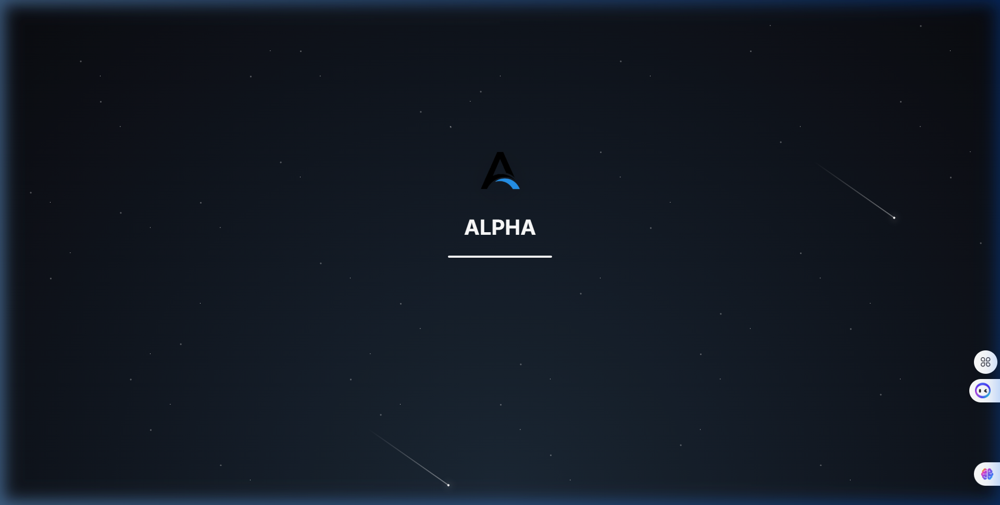

<p align="center">
  
</p>

<h1 align="center">Alpha — Real-Time Collaborative Kanban</h1>
<h3 align="center">with Autonomous AI Project Manager</h3>

<p align="center">
  
  
  
  
  
  
</p>

<p align="center">
  A production-grade, real-time collaborative project management platform where multiple users work on the same Kanban board simultaneously — powered by an autonomous AI Project Manager that detects bottlenecks, assesses sprint risks, infers task complexity, and generates weekly digests.
</p>

<p align="center">
  
</p>

---

## ✨ Feature Highlights

| Category | Features |
|---|---|
| **Real-Time Collaboration** | WebSocket-powered live sync • Drag-and-drop across columns • Instant card CRUD broadcasting • Multi-user conflict handling (last-write-wins with notifications) |
| **AI Project Manager** | Bottleneck Detection • Sprint Risk Assessment • Task Complexity Inference • Auto-Assignment Suggestions • Streaming AI Insights Panel • Weekly Digest Reports |
| **GitHub Integration** | Paste any public repo URL • Paginated issue import • Label mapping • Assignee matching • Incremental deduplication (no duplicate cards) |
| **Chrome Extension** | Clip from any webpage • Auto-fills selected text, page title, & URL • Board/column selector • Creates cards in real-time without opening the app |
| **Board Management** | Inline card creation • Card detail modal with comments & activity history • Labels, milestones, & complexity scores • Dependency/blocker mapping |
| **Team Analytics** | Per-member task load • Completion rates • Label specialisation • Sprint velocity tracking |
| **Time Tracking** | Start/stop timer per card • Countdown display • Logged time persisted in database |
| **Security** | JWT authentication • bcrypt password hashing • Helmet.js security headers • Rate limiting • HTTP-only cookies |

---

## 🏗️ Architecture

```
┌──────────────────────────────────────────────────────────┐
│                      BROWSER CLIENT                       │
│  ┌─────────┐ ┌──────────┐ ┌──────────┐ ┌──────────────┐ │
│  │ Board   │ │ AI Panel │ │ Team View│ │ GitHub Import│ │
│  │ (D&D)   │ │ (Stream) │ │          │ │              │ │
│  └────┬────┘ └────┬─────┘ └────┬─────┘ └──────┬───────┘ │
│       │           │            │               │         │
│       └───────────┴────────────┴───────────────┘         │
│                        │  Socket.IO + REST                │
└────────────────────────┼─────────────────────────────────┘
                         │
┌────────────────────────┼─────────────────────────────────┐
│                   EXPRESS SERVER                          │
│  ┌──────────┐ ┌───────────┐ ┌────────────┐ ┌──────────┐ │
│  │ REST API │ │ WebSocket │ │ AI Engine  │ │ Scraper  │ │
│  │ (CRUD)   │ │ (Socket)  │ │ (Gemini)   │ │ (GitHub) │ │
│  └────┬─────┘ └─────┬─────┘ └─────┬──────┘ └────┬─────┘ │
│       │             │             │              │       │
│       └─────────────┴─────────────┴──────────────┘       │
│                        │                                  │
│              ┌─────────┴──────────┐                      │
│              │  SQLite (WAL Mode) │                      │
│              │   better-sqlite3   │                      │
│              └────────────────────┘                      │
└──────────────────────────────────────────────────────────┘
```

---

## 🚀 Quick Start

### Prerequisites

- **Node.js** 18+ ([download](https://nodejs.org))
- **Gemini API Key** (free at [Google AI Studio](https://aistudio.google.com/apikey))

### Installation

```bash
# 1. Clone the repository
git clone https://github.com/<your-username>/Alpha.git
cd Alpha

# 2. Install dependencies
npm install

# 3. Configure environment
cp .env.example .env
# Edit .env and add your GEMINI_API_KEY

# 4. Start the server
npm run dev

# 5. Open in browser
# → http://localhost:3000
```

### Environment Variables

| Variable | Description | Default |
|---|---|---|
| `GEMINI_API_KEY` | Google Gemini API key for AI features | *required* |
| `PORT` | Server port | `3000` |
| `JWT_SECRET` | Secret for JWT token signing | `alpha-super-secret-key-2026` |

---

## 🧠 AI Project Manager — How It Works

The AI engine runs as a **background scheduled process** (configurable, default every 6 hours via `node-cron`) and performs multiple analyses on each board:

### Bottleneck Detection
Identifies columns where cards accumulate faster than they leave. The AI doesn't just flag the bottleneck — it identifies the **root cause**: an overloaded assignee, a stuck label category, or a dependency chain blocking downstream tasks.

### Sprint Risk Assessment
If a board has a sprint end date, the AI calculates current velocity (cards completed/day) and projects whether the team will finish on time. Produces a plain-English risk summary with actionable recommendations.

### Task Complexity Inference
When a new card is created, the AI analyzes the title and description to infer complexity on a 1–5 story point scale. The inferred score appears as a **suggestion** the user can accept or override — never forced.

### Auto-Assignment Suggestions
For unassigned cards, the AI suggests the best team member based on:
- Historical completion speed for similar tasks
- Current in-progress workload
- Label specialization history

### Streaming Insights
All AI results **stream to the UI in real-time** via Socket.IO, appearing progressively in the AI Insights panel — not dumped all at once.

### Graceful Degradation
If the Gemini API is rate-limited or unavailable, the system falls back to **heuristic-based analysis** and mock streaming responses, ensuring the AI panel always functions.

---

## 🔄 Real-Time Collaboration

### WebSocket Architecture
Built on **Socket.IO v4** for bidirectional, event-driven communication:

- **Card CRUD**: Create, update, delete events broadcast instantly to all connected clients
- **Drag & Drop**: Column-to-column card moves sync across all browsers in real-time
- **AI Streaming**: AI analysis results stream live to all board viewers
- **Presence**: Users join board-specific rooms for targeted broadcasting

### Conflict Handling Strategy: Last-Write-Wins with Notification

When two users edit the same card simultaneously:
1. Both edits are accepted by the server in arrival order
2. The **last write wins** and becomes the persisted state
3. All clients receive the updated card via WebSocket
4. A **toast notification** appears for affected users showing the change

This approach was chosen over Operational Transformation (OT) for simplicity and reliability in a Kanban context where card edits are typically short, discrete operations (unlike collaborative text editing).

### Concurrency Testing
The system has been designed to handle **10+ simultaneous users** on a single board. SQLite's WAL (Write-Ahead Logging) mode enables concurrent reads without blocking, and the event-driven Node.js architecture handles WebSocket connections efficiently.

---

## 📦 GitHub Issues Scraper

### Usage
1. Navigate to the **GitHub Import** panel in the UI
2. Paste any public GitHub repository URL (e.g., `https://github.com/facebook/react`)
3. Preview the issues to be imported (count + sample titles)
4. Select target board and column
5. Click **Import**

### Technical Details
- **Pagination**: Uses GitHub's REST API with `per_page=100` and follows `Link` headers for repositories with 100+ issues
- **Deduplication**: Tracks `github_issue_id` + `github_repo` pairs in the database. Re-importing the same repo skips existing issues
- **Label Mapping**: GitHub labels are preserved and mapped to Alpha's label system
- **Assignee Matching**: Maps GitHub usernames to board members when a match exists

---

## 🔌 Chrome Extension

### Installation
1. Download or unzip the `chrome-extension/` folder
2. Open `chrome://extensions/` in Chrome
3. Enable **Developer mode** (toggle in top-right)
4. Click **Load unpacked** → select the `chrome-extension` folder

### Usage
- **Clip selected text**: Highlight text on any webpage → click extension icon → text is pre-filled as the task description
- **Clip entire page**: Click extension icon without selecting text → page title and URL are auto-filled
- Select your **board** and **column**, edit the title if needed, and click **Clip to Alpha**
- The card appears on your board **instantly via WebSocket** — no refresh needed

### How It Works
- Uses a **content script** injected into all pages to capture selected text, page title, and URL
- The **popup** communicates with the Alpha server via REST API (`POST /api/cards`)
- Server URL is configurable and persisted in `chrome.storage.local`

---

## 🗄️ Database Schema

Alpha uses **SQLite** via `better-sqlite3` with WAL mode for high-performance concurrent access.

```sql
users              → id, username, password_hash, created_at
boards             → id, name, description, sprint_end_date, created_at
columns            → id, board_id, name, position, color
cards              → id, column_id, board_id, title, description, assignee_id,
                     complexity, complexity_accepted, position, labels (JSON),
                     github_issue_id, github_repo, reference_url, milestone,
                     time_spent, created_at, updated_at
card_dependencies  → blocker_id, blocked_id
board_members      → board_id, user_id, role, github_username
activity_log       → id, card_id, board_id, action, details, created_at
ai_insights        → id, board_id, type, data (JSON), created_at
comments           → id, card_id, user_id, text, created_at
```

Data persists across server restarts. The database file is stored at `data/alpha.db`.

---

## 📁 Project Structure

```
Alpha/
├── server/
│   ├── index.js              # Express + Socket.IO entry point
│   ├── ai/
│   │   ├── llm.js            # Gemini API wrapper
│   │   ├── bottleneck.js     # Bottleneck detection engine
│   │   ├── sprintRisk.js     # Sprint risk assessment
│   │   ├── complexity.js     # Task complexity inference
│   │   ├── autoAssign.js     # Auto-assignment suggestions
│   │   ├── digest.js         # Weekly digest generation
│   │   ├── streaming.js      # Real-time AI streaming
│   │   └── scheduler.js      # Cron-based AI scheduler
│   ├── db/
│   │   └── database.js       # SQLite schema, queries, migrations
│   ├── routes/
│   │   ├── auth.js           # JWT auth (signup/login/logout)
│   │   ├── boards.js         # Board CRUD
│   │   ├── cards.js          # Card CRUD + move + timer
│   │   └── ai.js             # AI endpoints
│   ├── scraper/
│   │   └── github.js         # GitHub Issues scraper
│   └── websocket/
│       └── handler.js        # Socket.IO event handlers
├── public/
│   ├── index.html            # Single-page application
│   ├── css/                  # Modular CSS (tokens, glass, cards, etc.)
│   ├── js/                   # Client-side modules
│   └── images/               # Static assets
├── chrome-extension/
│   ├── manifest.json         # MV3 Chrome extension manifest
│   ├── popup.html/js         # Extension popup UI & logic
│   ├── content.js            # Page content extraction
│   └── background.js         # Service worker
├── data/                     # SQLite database (auto-created)
├── package.json
├── .env                      # Environment variables
└── README.md
```

---

## 🎨 UI Design

The interface uses a **glassmorphism** design language with:
- Frosted glass cards and panels with `backdrop-filter: blur()`
- Animated **space background** with CSS comet animations
- Smooth micro-animations and transitions throughout
- Responsive layout that works on desktop and tablet
- Dark space theme with high-contrast text for readability
- Custom toast notification system
- Inline card creation for speed (no modal required)

---

## 🔒 Security

| Layer | Implementation |
|---|---|
| **Authentication** | JWT tokens stored in HTTP-only cookies |
| **Password Storage** | bcrypt with 10 salt rounds |
| **HTTP Headers** | Helmet.js with CSP, X-Frame-Options, etc. |
| **Rate Limiting** | express-rate-limit (1000 req/15min per IP) |
| **CORS** | Configured for cross-origin extension access |
| **Input Validation** | Server-side validation on all API endpoints |

---

## 🛠️ API Reference

### Authentication
| Method | Endpoint | Description |
|---|---|---|
| `POST` | `/api/auth/signup` | Create account |
| `POST` | `/api/auth/login` | Login |
| `POST` | `/api/auth/logout` | Logout |
| `GET` | `/api/auth/me` | Get current user |

### Boards
| Method | Endpoint | Description |
|---|---|---|
| `GET` | `/api/boards` | List all boards |
| `GET` | `/api/boards/:id` | Get board with columns & cards |
| `POST` | `/api/boards` | Create board |

### Cards
| Method | Endpoint | Description |
|---|---|---|
| `POST` | `/api/cards` | Create card |
| `PUT` | `/api/cards/:id` | Update card |
| `PUT` | `/api/cards/:id/move` | Move card to column |
| `DELETE` | `/api/cards/:id` | Delete card |
| `POST` | `/api/cards/:id/timer/start` | Start timer |
| `POST` | `/api/cards/:id/timer/stop` | Stop timer |

### AI
| Method | Endpoint | Description |
|---|---|---|
| `POST` | `/api/ai/analyze/:boardId` | Trigger full AI analysis |
| `POST` | `/api/ai/stream/:boardId` | Stream AI brainstorm |
| `GET` | `/api/ai/insights/:boardId` | Get saved insights |

### GitHub
| Method | Endpoint | Description |
|---|---|---|
| `POST` | `/api/github/import` | Import issues from repo |

---

## 🚢 Deployment

### Render (Recommended — Free Tier)

1. Push your code to GitHub
2. Go to [render.com](https://render.com) → **New Web Service**
3. Connect your GitHub repo
4. Configure:
   - **Build Command**: `npm install`
   - **Start Command**: `npm start`
   - **Environment Variables**: Set `GEMINI_API_KEY`
5. Deploy!

### Railway

1. Install Railway CLI: `npm i -g @railway/cli`
2. `railway init` → `railway up`
3. Set environment variables in Railway dashboard

### Docker (Self-hosted)

```dockerfile
FROM node:18-alpine
WORKDIR /app
COPY package*.json ./
RUN npm ci --production
COPY . .
EXPOSE 3000
CMD ["npm", "start"]
```

---

## 📋 Bonus Features Implemented

- [x] **Dependency Mapping** — Cards can be linked as blockers. The AI bottleneck detector accounts for dependency chains.
- [x] **Time Tracking** — Start/stop timer on each card. Logged time persists and informs AI complexity inference.
- [x] **Board Templates** — Pre-built column structures for common workflows.
- [x] **Chrome Extension** — Full web clipper with text selection, board/column picker, and real-time sync.

---

## 📄 License

This project is licensed under the **MIT License**. See [LICENSE](LICENSE) for details.

---

<p align="center">
  Built with ❤️ by <strong>Vedhant</strong>
</p>
